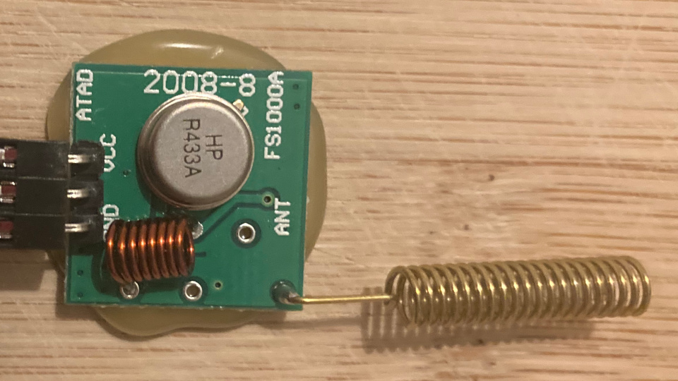

# Polladen

The original Python program is in the [`main` branch](https://github.com/MrBatschner/Polladen/tree/main).

A small tool to control a 433MHz remote controlled window shutter from a Raspberry Pi. This is a rewrite of the Python script into a small C program so that all you need is a small ~60kB binary with no need for a full Python runtime environment.

It supports RF controlled window shutter motors from the German suppliers [3T Motors](https://www.3t-motors.de/), [Rohrmotor24](https://www.rohrmotor24.eu/rohrmotor24_1), [Julius Mayer](https://www.julius-mayer.com/julius-mayer-funk-rollladenmotor/) and possibly many many more (a good indicator is that the motor beeps when initially powered on).

The intention is to control these motors from a Raspberry Pi which has a simple 433MHz transmitter connected to one of its GPIO pins.

Other than the Python implementation of Polladen, this C rewrite does not support the `pair` or `change-direction` command.

The name _polladen_ is for **P**ython R**olladen** (German for shutter) - even though this is a C rewrite, the original is written in Python and _colladen_ sounds even stupider.

## Setup

1. You need a Raspberry Pi

1. You need one of these cheap 433MHz transmitters/receivers you can find on eBay, Amazon, etc. A small PCB with one or two coils and a coin-shaped component on it.

    

1. Connect your 433MHz transmitter to the GPIO header of your Raspberry Pi
   These simple transmitters have three pins, `GND`, `VCC` and `ADAT`. 
   
   Connect the 433MHz transmitter to the Raspberry Pi like this:

   ```
   GND  -> Pin  6 on the GPIO header
   VCC  -> Pin  2 on the GPIO header
   ADAT -> Pin 11 on the GPIO header
   ```

1. You need the [`bcm2835` library](https://www.airspayce.com/mikem/bcm2835/) which you need to download, `configure`, `make` and `make install`.

1. No Makefile for _polladen_ in C is provided, as a simple `gcc -o polladen polladen.c` should suffice to build the program.

1. _polladen_ emulates an RF remote, thus it needs to be paired to the motor like a normal remote.

1. Use the program and integrate it into your favorite home automation platform.


## Pairing

### Remote IDs

Every remote for these shutter motors has a unique ID that is embedded into it at the factory. When the instruction manual tells you to pair the remote with a motor (something like powering on the motor and within ten seconds press _p2-button_, _p2-button_, _up_-button), the motor is instructed to - from now on - listen to RF signals with that remote's ID in them.

The remote ID is 28 bits, allowing for 268,435,456 uniquely identifiable remotes. _Polladen_ however sets 12 of these bits to fixed values, leaving you with 65,536 unique IDs.

When using _polladen_ you need to specify the remote ID it should send. The idea is not to find out the ID of one of your existing remotes (which would be possible with a scope and decrypting an RF datagram) but to pair _polladen_ as a new remote to the motor.

Therefore, to use _polladen_, you need to make up a unique remote ID (any number between `0` and `65535` - or use the default `0x42` which is `66`in decimal) that you then need to supply with the `-r` parameter each time you use the program.

### Channel IDs

Every remote can control up to 15 different motors individually on different channels. Which channel a motor reacts to is determined on which channel your remote was during pairing. There is one special case though: if channel `0` (zero) is used, all motors paired to that remote will react.

The channel ID to be used for all operations can be submitted to _polladen_ with the `-c` parameter. The default channel is `1`.

Even though possible at the moment, please do not attempt to pair your motor on channel `0`.

### Pairing _polladen_ as a new remote

To pair _polladen_ to your shutter motor, follow the instruction in your motors manual. However, instead of pressing some buttons on a remote after powering the motor on, you just take your remote ID and within ten seconds, you run the program like this:

```
./polladen -r <remote-id> -c <channel-id> learn
./polladen -r <remote-id> -c <channel-id> learn
./polladen -r <remote-id> -c <channel-id> up
```

### Pairing _polladen_ as additional remote (recommended)

Motors can be paired to more than one remote. Pairing _polladen_ as an additional remote is absolutely recommended so that you can still control your shutters with a real remote.

Follow your motor's instruction manual on how to use your existing remote to put the motor into pairing mode again and do this to pair _polladen_ as an additional remote:

```
./polladen -r <remote-id> -c <channel-id> learn
```


## Usage

```
usage: polladen [-r REMOTE_ID] [-c CHANNEL] command

Control Dooya (and derivatives) window shutter motors over their 433MHz RF protocol.

positional arguments:
  command               the command to execute
                          must be one of: up, down, stop, learn
optional arguments:
  -h, --help            show this help message and exit
  -r REMOTE_ID, --remote-id REMOTE_ID
                        the id of the remote control we are emulating
                          any value between 1 and 65535)
  -c CHANNEL, --channel CHANNEL
                        the channel to send on - any value between 0 and 15
                          channel 0 is a the group channel
```

As command, you can supply one of the following:

| Command | Purpose |
|---|---|
| `up` | Moves the shutter up |
| `down` | Moves the shutter down |
| `stop` | Stops the shutter |
| `learn` | Equivalent to the `setup` or `p2` button on a remote and used to add additional remote or configure the motor |


## Examples

### Pairing a shutter motor to remote-id 1337 and channel 4

```
./polladen -r 1337 -c 4 learn
./polladen -r 1337 -c 4 learn
./polladen -r 1337 -c 4 up
```

### Move the shutter down

```
./polladen -r 1337 -c 4 down
```
